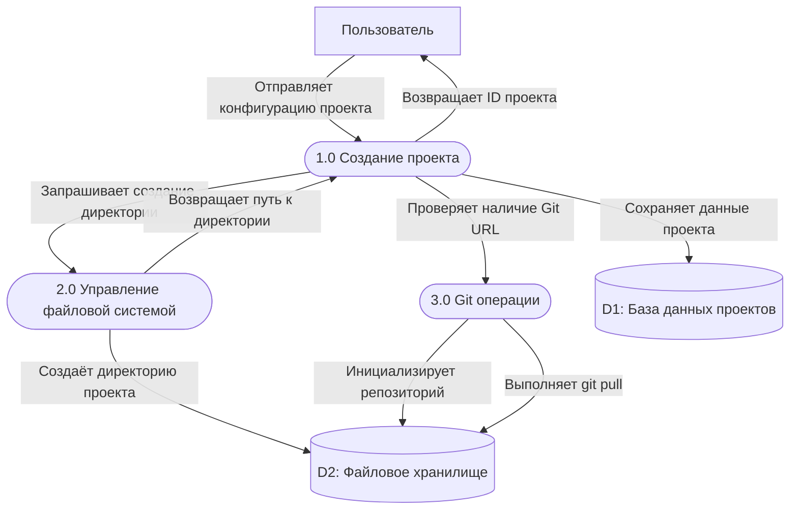
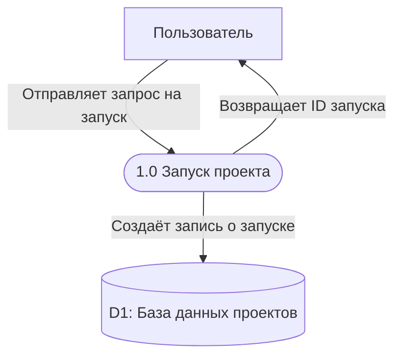
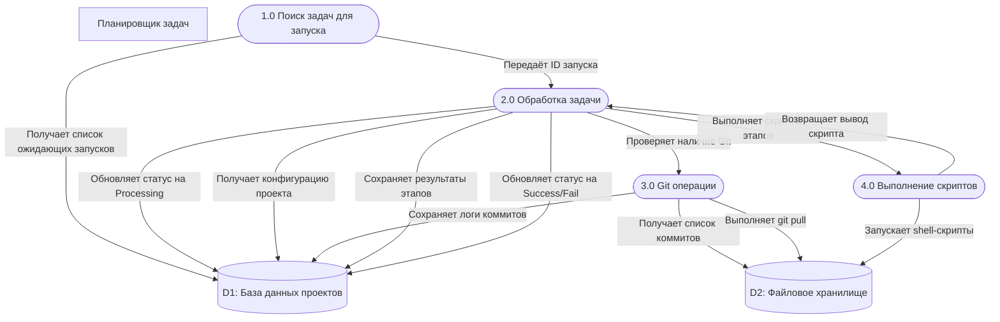
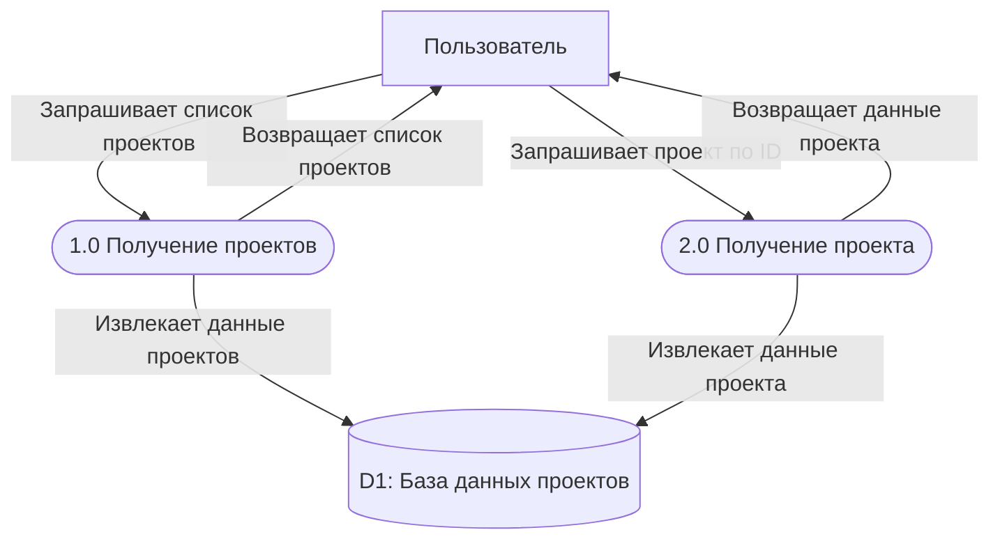
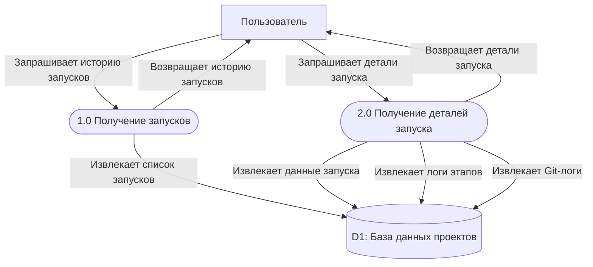
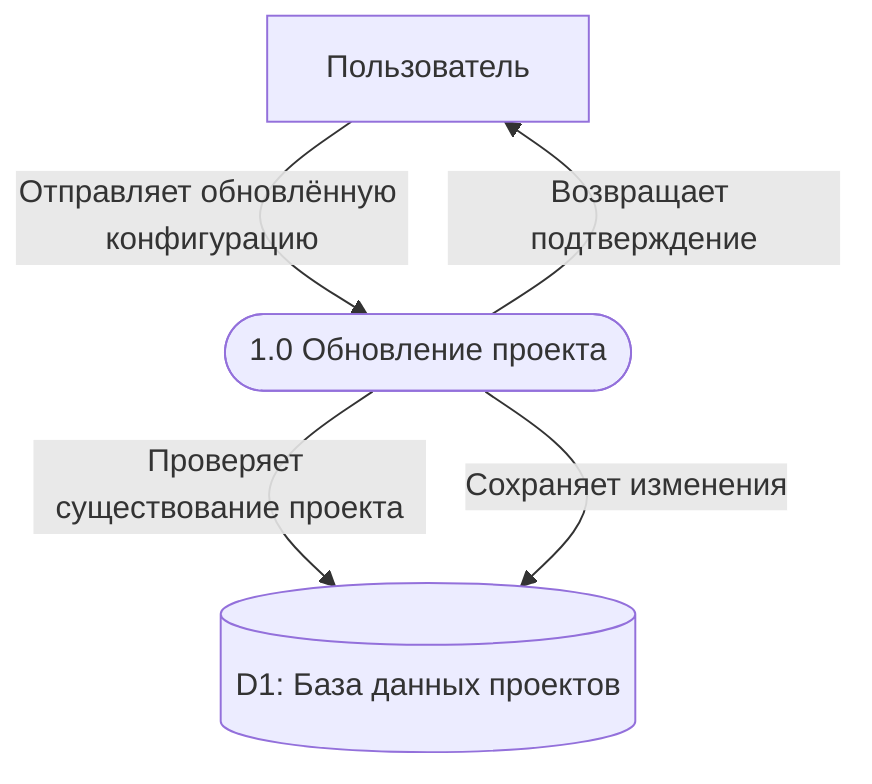

# DFD Диаграммы (Data Flow Diagram)

Данный документ описывает потоки данных в системе EasyJet через DFD-диаграммы.

## 1. Регистрация нового проекта

**Описание:** Процесс создания нового проекта в системе. Пользователь отправляет конфигурацию проекта, система сохраняет её в базу данных, создаёт директорию для проекта и при необходимости инициализирует Git-репозиторий.

## 2. Запуск развёртывания проекта

**Описание:** Пользователь инициирует запуск развёртывания проекта. Система создаёт запись о запуске в базе данных и помечает её как ожидающую выполнения.

## 3. Обработка ожидающих развёртываний

**Описание:** Фоновый рабочий процесс периодически проверяет базу данных на наличие ожидающих развёртываний и обрабатывает их. Этот процесс выполняется автоматически без участия пользователя.

**FIXME:** требуется коррекция диаграммы

## 4. Получение информации о проекте

**Описание:** Пользователь запрашивает информацию о конкретном проекте или список всех проектов. Система извлекает данные из базы данных и возвращает их пользователю.

## 5. Получение истории запусков проекта

**Описание:** Пользователь запрашивает историю запусков для конкретного проекта или детали отдельного запуска. Система извлекает данные о запусках включая логи этапов и Git-логи.

## 6. Обновление конфигурации проекта

**Описание:** Пользователь обновляет конфигурацию существующего проекта (Git URL, ветку, скрипты этапов). Система сохраняет изменения в базе данных.

## Условные обозначения

| Элемент          | Нотация (объявление)            | Нотация (в потоках) | Описание                           |
| ---------------- | ------------------------------- | ------------------- | ---------------------------------- |
| Внешняя сущность | `User[Название]`                | `User`              | Пользователь или внешняя система   |
| Процесс          | `CreateProject([1.0 Название])` | `CreateProject`     | Действие или функция системы       |
| Хранилище данных | `DB1[(D1: Название)]`           | `DB1`               | База данных или файловое хранилище |
| Поток данных     | `-->\|Описание\|`               | `-->\|Описание\|`   | Направление и содержание потока    |

**Важно:** В потоках данных используйте только имена элементов без повторения нотации. Например: `User -->|Отправляет данные| CreateProject`

**Важно:** Идентификатор процесса должен быть осмысленным (`CreateProject`, `GetRuns`), а не общим (`Process1`, `Process2`).

## Хранилища данных

| ID  | Название             | Описание                                                                                |
| --- | -------------------- | --------------------------------------------------------------------------------------- |
| D1  | База данных проектов | SQLite/PostgreSQL база с таблицами: projects, stages, runs, run_stages, run_git_commits |
| D2  | Файловое хранилище   | Файловая система сервера для хранения скриптов и проектов                               |
