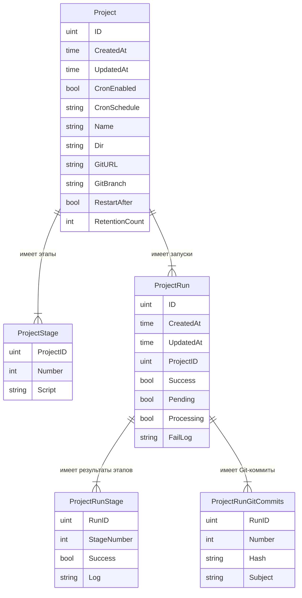

# Бизнес-сущности

Описание основных бизнес-сущностей системы EasyJet.

## Проект (Project)

**Название в коде:** `Project`

Проект представляет собой конфигурацию автоматизированного пайплайна для конкретного репозитория. Это основная сущность, которая определяет, какие действия должны выполняться при обработке кода.

### Поля

| Поле             | Тип       | Назначение                                                            |
| ---------------- | --------- | --------------------------------------------------------------------- |
| `ID`             | uint      | Уникальный идентификатор проекта в системе                            |
| `CreatedAt`      | time.Time | Дата и время создания проекта                                         |
| `UpdatedAt`      | time.Time | Дата и время последнего изменения конфигурации проекта                |
| `CronEnabled`    | bool      | Флаг включения автоматического расписания (cron)                      |
| `CronSchedule`   | string    | Cron-выражение для автоматического запуска (например, "0 5 \* \* \*") |
| `Name`           | string    | Человеко-читаемое имя проекта для идентификации в интерфейсе          |
| `Dir`            | string    | Локальный путь к рабочей директории проекта на сервере                |
| `GitURL`         | string    | URL Git-репозитория для получения исходного кода                      |
| `GitBranch`      | string    | Имя ветки Git, которая используется для сборки                        |
| `RestartAfter`   | bool      | Флаг перезапуска приложения после выполнения задачи                   |
| `RetentionCount` | int       | Количество последних запусков для хранения (0 - отключить)            |

## Этап проекта (ProjectStage)

**Название в коде:** `ProjectStage`

Этап проекта — это один шаг в пайплайне выполнения проекта. Каждый этап содержит скрипт, который должен быть выполнен. Этапы выполняются последовательно в порядке возрастания номера.

### Поля

| Поле        | Тип    | Назначение                                                             |
| ----------- | ------ | ---------------------------------------------------------------------- |
| `ProjectID` | uint   | Ссылка на проект, которому принадлежит этап                            |
| `Number`    | int    | Порядковый номер этапа (начинается с 1). Определяет порядок выполнения |
| `Script`    | string | Команда или скрипт, выполняемый на данном этапе                        |

## Запуск проекта (ProjectRun)

**Название в коде:** `ProjectRun`

Запуск проекта — это результат выполнения пайплайна для конкретного проекта. Каждая активация автоматизации создаёт новую сущность запуска, которая хранит информацию о процессе выполнения, его результате и логах.

### Поля

| Поле         | Тип       | Назначение                                                                   |
| ------------ | --------- | ---------------------------------------------------------------------------- |
| `ID`         | uint      | Уникальный идентификатор запуска                                             |
| `CreatedAt`  | time.Time | Время начала запуска                                                         |
| `UpdatedAt`  | time.Time | Время последнего обновления статуса запуска                                  |
| `ProjectID`  | uint      | Ссылка на проект, для которого выполнен запуск                               |
| `Success`    | bool      | Флаг успешного завершения всех этапов пайплайна                              |
| `Pending`    | bool      | Флаг ожидания начала выполнения (запуск создан, но ещё не начал выполняться) |
| `Processing` | bool      | Флаг активного выполнения (пайплайн в процессе работы)                       |
| `FailLog`    | string    | Лог ошибки, если запуск завершился неудачей                                  |

## Результат этапа запуска (ProjectRunStage)

**Название в коде:** `ProjectRunStage`

Результат выполнения конкретного этапа в рамках запуска проекта. Содержит информацию об успехе/неудаче этапа и лог выполнения.

### Поля

| Поле          | Тип    | Назначение                                                                          |
| ------------- | ------ | ----------------------------------------------------------------------------------- |
| `RunID`       | uint   | Ссылка на запуск, которому принадлежит результат этапа                              |
| `StageNumber` | int    | Номер этапа, к которому относится результат (соответствует `Number` в ProjectStage) |
| `Success`     | bool   | Флаг успешного выполнения этапа                                                     |
| `Log`         | string | Лог выполнения этапа (вывод скрипта)                                                |

## Коммит Git полученый в результате запуска проекта (ProjectRunGitCommits)

**Название в коде:** `ProjectRunGitCommits`

Информация о Git-коммитах, которые были обработаны в рамках данного запуска. Позволяет отследить, какие изменения в коде вызвали выполнение пайплайна.

### Поля

| Поле      | Тип    | Назначение                                    |
| --------- | ------ | --------------------------------------------- |
| `RunID`   | uint   | Ссылка на запуск, которому принадлежит запись |
| `Number`  | int    | Порядковый номер коммита в списке             |
| `Hash`    | string | Хэш коммита в Git-репозитории                 |
| `Subject` | string | Сообщение коммита (первая строка)             |

## Коммит (Commit)

**Название в коде:** `Commit`

Представление Git-коммита, используемое для передачи информации об изменениях в коде.

### Поля

| Поле      | Тип    | Назначение                                |
| --------- | ------ | ----------------------------------------- |
| `Hash`    | string | Уникальный хэш коммита в Git              |
| `Subject` | string | Краткое описание изменений (тема коммита) |

## Связи между сущностями

- Один **Проект** имеет множество **Этапов проекта** (конфигурация пайплайна)
- Один **Проект** может иметь множество **Запусков проекта** (история выполнений)
- Один **Запуск проекта** имеет множество **Результатов этапов** (детали выполнения)
- Один **Запуск проекта** имеет множество **Git-коммитов** (связанные коммиты)
