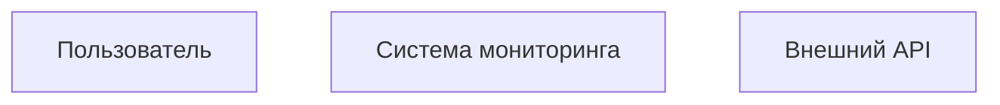
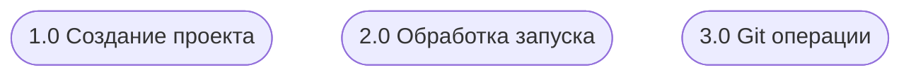
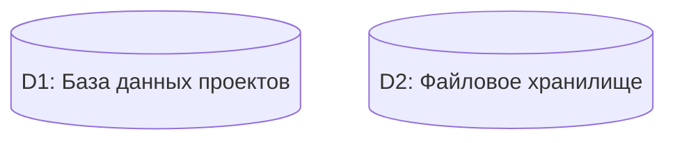
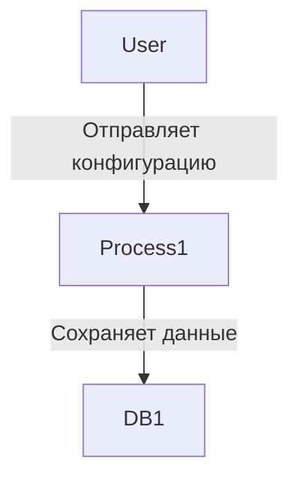
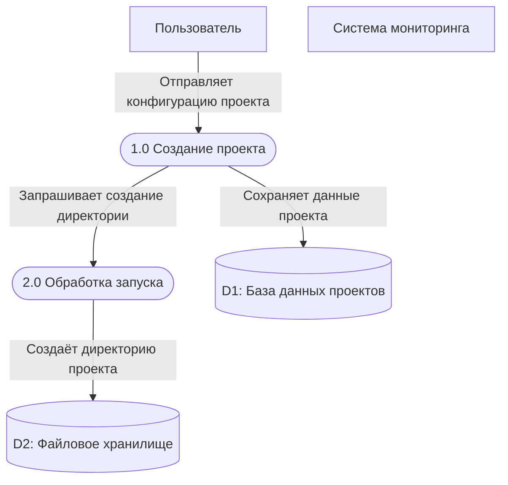
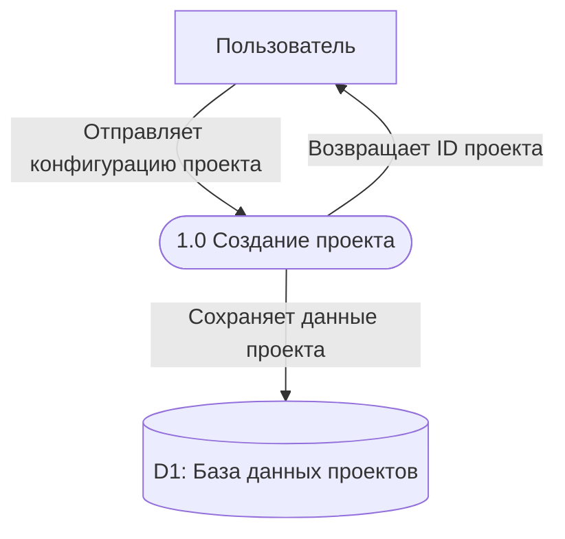
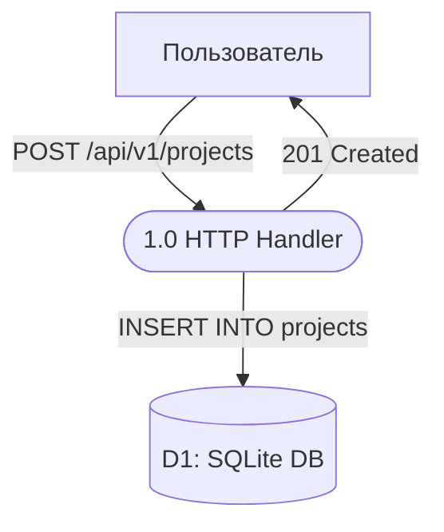
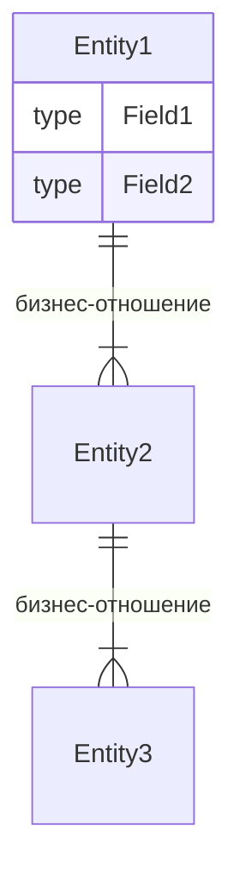
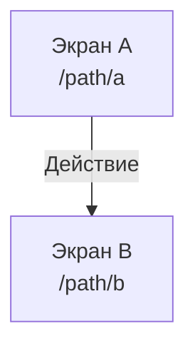

# Правила описания бизнес-документации

Правила создания и оформления файлов бизнес-документации в директории `docs/business/`.

## DFD-диаграммы (Data Flow Diagram)

Данный раздел описывает обязательные правила для создания и поддержания DFD-диаграмм в проекте EasyJet.

### Общие требования

#### Назначение документа

DFD-диаграммы используются для описания бизнес-процессов системы в терминах потоков данных между сущностями, процессами и хранилищами.

#### Целевая аудитория

Диаграммы должны быть понятны:

- Бизнес-пользователям без технического образования
- Разработчикам для понимания бизнес-контекста
- Аналитикам для документирования требований

#### Язык описания

- Все названия и описания должны быть на **русском языке**
- Технические термины (Git, Docker, API) сохраняются в оригинале
- Описания процессов должны использовать бизнес-терминологию, а не технические детали

### Правила нотации Mermaid

#### Внешние сущности

Внешние сущности обозначаются через `User[Название]`:



**Правила:**

- Название должно описывать роль сущности в бизнес-процессе
- Избегайте технических названий (используйте «Пользователь» вместо «HTTP Client»)

#### Процессы

Процессы обозначаются через `Process([N.0 Название])`:



**Правила:**

- Нумерация формата `X.0` для процессов первого уровня
- Название должно описывать **что делается**, а не **как**
- Используйте отглагольные существительные (Создание, Обработка, Получение)
- Избегайте технических деталей (не «HTTP Handler», а «Получение проекта»)
- **Идентификатор процесса должен быть осмысленным**, а не общим (`Process1`, `Process2`)

| ✅ Правильно                                | ❌ Неправильно                            |
| ------------------------------------------- | ----------------------------------------- |
| `SearchTask([1.0 Поиск задач для запуска])` | `Process1([1.0 Поиск задач для запуска])` |
| `HandleOneTask([2.0 Обработка задачи])`     | `Process2([2.0 Обработка задачи])`        |
| `GitHandle([3.0 Git операции])`             | `Process3([3.0 Git операции])`            |
| `ShellExecute([4.0 Выполнение скриптов])`   | `Process4([4.0 Выполнение скриптов])`     |

**Почему это важно:**

- ✅ **Читаемость:** По имени процесса сразу понятно что он делает
- ✅ **Поддержка:** Легче находить процессы в коде и документации
- ✅ **Согласованность:** Идентификатор отражает назначение процесса

#### Хранилища данных

Хранилища обозначаются через `DataBase[(D1: Название)]`:



**Правила:**

- Нумерация формата `D1`, `D2`, `D3`...
- Название должно описывать **что хранится**, а не технологию
- Допускается уточнение технологии в скобках при необходимости

#### Потоки данных

Потоки обозначаются через `From -->|Что происходит| To`:



**Правила:**

- Описание потока должно начинаться с глагола
- Используйте активный залог (отправляет, сохраняет, получает)
- Описание должно быть кратким (2-5 слов)
- Избегайте технических деталей (не «POST /api/projects», а «Отправляет конфигурацию»)
- **В потоках данных используйте только имена элементов без повторения нотации** (см. ниже)

#### Порядок описания элементов диаграммы

**Важное правило:** Перед описанием потоков данных необходимо явно объявить все используемые элементы диаграммы.

**Правильный порядок описания:**



**Правила описания потоков:**

| ✅ Правильно                                           | ❌ Неправильно                                                                                         |
| ------------------------------------------------------ | ------------------------------------------------------------------------------------------------------ |
| `User -->\|Отправляет конфигурацию проекта\| Process1` | `User[Пользователь] -->\|Отправляет конфигурацию проекта\| Process1([1.0 Создание проекта])`           |
| `Process1 -->\|Сохраняет данные\| DB1`                 | `Process1([1.0 Создание проекта]) -->\|Сохраняет данные\| DB1[(D1: База данных проектов)]`             |
| `Process2 -->\|Создаёт директорию\| FS1`               | `Process2([2.0 Управление файловой системой]) -->\|Создаёт директорию\| FS1[(D2: Файловое хранилище)]` |

**Почему это важно:**

- ✅ **Читаемость:** Потоки данных легче читать, когда они не перегружены повторяющейся информацией
- ✅ **Поддержка:** При изменении названия элемента нужно изменить его только в одном месте (объявлении)
- ✅ **Согласованность:** Гарантируется использование одинаковых имён во всех потоках
- ✅ **Компактность:** Диаграмма занимает меньше места и выглядит чище

### Структура документа

#### Обязательные элементы каждой диаграммы

Каждая DFD-диаграмма должна содержать:

1. **Заголовок** — название процесса (например, «1. Регистрация нового проекта»)
2. **Описание** — краткое описание бизнес-процесса (1-3 предложения)
3. **Диаграмма** — визуальное представление в Mermaid

#### Шаблон описания процесса

````markdown
## N. Название процесса

**Описание:** Краткое описание бизнес-процесса. Что инициирует процесс, какие данные используются, какой результат ожидается.

```mermaid
flowchart TD
    [диаграмма]
```
````

#### Группировка процессов

- Диаграммы нумеруются последовательно
- Связанные процессы должны располагаться рядом
- Сложные процессы могут быть декомпозированы на подпроцессы (N.1, N.2, N.3)

### Требования к описаниям

#### Бизнес-терминология

Используйте термины понятные бизнес-пользователям:

| ❌ Не рекомендуется | ✅ Рекомендуется          |
| ------------------- | ------------------------- |
| HTTP Handler        | Получение данных          |
| Git Init            | Инициализация репозитория |
| Database Query      | Извлечение данных         |
| Shell Execution     | Выполнение скриптов       |
| API Endpoint        | Запрос к системе          |

#### Уровень детализации

- **DFD Level 1** (основной): Процессы первого уровня (1.0, 2.0, 3.0)
- **DFD Level 2** (детальный): При необходимости декомпозиции (1.1, 1.2, 1.3)

#### Полнота описания

Каждая диаграмма должна отвечать на вопросы:

- **Кто** инициирует процесс?
- **Что** происходит с данными?
- **Где** хранятся данные?
- **Какой** результат ожидается?

### Примеры

#### Пример правильной диаграммы



#### Пример неправильной диаграммы



**Ошибки:**

- ❌ Технические названия процессов (HTTP Handler)
- ❌ Технические детали потоков (HTTP методы, SQL запросы, статус коды)
- ❌ Указание конкретной технологии БД вместо бизнес-названия

### Контрольный список

Перед добавлением DFD-диаграммы убедитесь:

- [ ] Все элементы используют правильную нотацию Mermaid
- [ ] Процесс имеет заголовок и описание
- [ ] Описания понятны не-техническому специалисту
- [ ] Нет технических деталей в названиях потоков
- [ ] Все хранилища имеют идентификатор (D1, D2...)
- [ ] Все процессы имеют идентификатор (1.0, 2.0...)
- [ ] Диаграмма отображает полный цикл процесса (вход → обработка → выход)

### Поддерживаемые хранилища данных

| ID  | Название             | Описание                                                                                |
| --- | -------------------- | --------------------------------------------------------------------------------------- |
| D1  | База данных проектов | SQLite/PostgreSQL база с таблицами: projects, stages, runs, run_stages, run_git_commits |
| D2  | Файловое хранилище   | Файловая система сервера для хранения скриптов и проекты                                |

При необходимости добавления новых хранилищ обновите эту таблицу.

### Поддерживаемые внешние сущности

| Сущность            | Описание                                               |
| ------------------- | ------------------------------------------------------ |
| Пользователь        | Человек взаимодействующий с системой через API/UI      |
| Система мониторинга | Внешние системы сбора метрик (Prometheus, Grafana)     |
| Внешний API         | Сторонние сервисы (Git-хостинги, notification сервисы) |

При необходимости добавления новых сущностей обновите эту таблицу.

## Общие принципы

### 1. Бизнес-ориентированность

Описывайте сущности и экраны с **бизнес-точки зрения**, а не технической:

- ❌ **Неправильно:** «Структура данных для хранения информации о проекте»
- ✅ **Правильно:** «Проект представляет собой конфигурацию автоматизированного пайплайна для конкретного репозитория»

### 2. Язык описания

- Пишите на **русском языке**
- Используйте **понятные бизнес-термины**
- Технические термины (ID, bool, string) оставляйте как есть
- Избегайте жаргона и излишней технической детализации

### 3. Структура файлов

Соблюдайте единую структуру файлов для согласованности документации.

## Описание бизнес-сущностей (`entity.md`)

### Структура описания каждой сущности

```markdown
## [Бизнес-название] ([CodeName])

**Название в коде:** `CodeName`

[Бизнес-описание сущности — 2-4 предложения]

### Поля

| Поле        | Тип  | Назначение               |
| ----------- | ---- | ------------------------ |
| `FieldName` | type | [Бизнес-назначение поля] |
```

### Правила описания сущностей

1. **Заголовок второго уровня** — бизнес-название сущности
2. **Название в коде** — выделите жирным и оберните в бэктики
3. **Описание** — объясните назначение сущности в бизнес-контексте
4. **Таблица полей** — обязательно включайте:
   - Имя поля (в бэкитиках)
   - Тип данных
   - Бизнес-назначение (что означает, а не как хранится)

### Описание связей между сущностями

В конце файла добавьте секцию со связями:

````markdown
## Связи между сущностями



- Один **Entity1** имеет множество **Entity2** (бизнес-пояснение)
- Один **Entity2** имеет множество **Entity3** (бизнес-пояснение)
````

### Правила описания связей

1. Используйте **Mermaid ER-диаграммы**
2. Показывайте только **значимые бизнес-связи**
3. Добавляйте **текстовые пояснения** к каждому типу связи
4. Включайте **список полей** для каждой сущности в диаграмме

## Описание экранов приложения (`screens.md`)

### Структура описания каждого экрана

```markdown
## [Номер]. [Бизнес-название] ([English Name])

**Путь:** `/path/to/screen`

**Компонент:** `path/to/component.vue`

### Описание

[Бизнес-описание экрана — 2-4 предложения]

### Сущности

| Сущность | Использование                |
| -------- | ---------------------------- |
| `Entity` | [Как используется на экране] |

### Действия

| Действие     | Описание     | Переход / Результат         |
| ------------ | ------------ | --------------------------- |
| **Название** | [Что делает] | [Куда ведёт или что делает] |

### API

- `METHOD /endpoint` — описание назначения
```

### Правила описания экранов

1. **Нумерация** — присваивайте порядковый номер каждому экрану
2. **Путь** — указывайте точный URL-путь
3. **Компонент** — указывайте относительный путь к компоненту
4. **Сущности** — перечисляйте только те, что используются на экране
5. **Действия** — описывайте с точки зрения пользователя
6. **API** — указывайте только используемые экраном эндпоинты

### Дополнительные секции (по необходимости)

Для сложных экранов добавляйте секции:

- **Поля формы** — для экранов с формами
- **Статусы** — для экранов со статусными индикаторами
- **Отображаемая информация** — для экранов с детальной информацией

### Описание навигации

В конце файла добавьте секцию с навигацией:

````markdown
## Навигация между экранами



### Таблица переходов

| Откуда  | Куда     | Триггер    | Метод      |
| ------- | -------- | ---------- | ---------- |
| `/path` | `/path2` | [Действие] | `method()` |
````

### Сводная таблица

Завершите файл сводной таблицей всех экранов:

```markdown
## Сводная таблица экранов

| Экран    | Путь    | Сущности | Основные действия      |
| -------- | ------- | -------- | ---------------------- |
| Название | `/path` | `Entity` | Действие 1, Действие 2 |
```

## Форматирование

### Разделители

- ❌ **Запрещено** использовать разделитель `---` между заголовками и секциями
- ✅ **Разрешено** использовать только пустые строки для разделения секций
- Это правило обязательно для улучшения читаемости документов

### Таблицы

- Используйте **Markdown-таблицы** с выравниванием по левому краю
- Заголовки столбцов делайте **краткими и понятными**
- Выравнивайте столбцы по ширине заголовка для читаемости

### Код и имена

- **Названия в коде** — выделяйте бэкитиками: `CodeName`
- **API-методы** — пишите капсом: `GET`, `POST`, `PUT`, `DELETE`
- **Пути** — заключайте в бэкитики: `/api/v1/projects`

### Mermaid-диаграммы

- Используйте **mermaid** для визуализации связей и навигации
- Для ER-диаграмм используйте синтаксис `erDiagram`
- Для навигации используйте `flowchart TD`
- Добавляйте **русские подписи** к связям и переходам

## Обновление документации

### Когда обновлять

Обновляйте бизнес-документацию при:

- Добавлении новых сущностей
- Изменении структуры существующих сущностей
- Добавлении новых экранов
- Изменении навигации между экранами
- Изменении бизнес-логики

### Порядок обновления

1. Внесите изменения в код
2. **Немедленно** обновите соответствующую документацию
3. Проверите, что связи и переходы описаны корректно
4. Убедитесь, что Mermaid-диаграммы отображаются корректно

## Примеры

### Хорошее описание поля

| Поле     | Тип    | Назначение                                       |
| -------- | ------ | ------------------------------------------------ |
| `GitURL` | string | URL Git-репозитория для получения исходного кода |

✅ Понятно бизнес-назначение

### Плохое описание поля

| Поле     | Тип    | Назначение            |
| -------- | ------ | --------------------- |
| `GitURL` | string | Поле для хранения URL |

❌ Слишком технически, неясно зачем нужно

### Хорошее описание действия

| Действие             | Описание                          | Переход                          |
| -------------------- | --------------------------------- | -------------------------------- |
| **Запустить проект** | Создание нового запуска пайплайна | `POST /api/v1/projects/:id/runs` |

✅ Ясно что делает и результат

### Плохое описание действия

| Действие | Описание         | Переход |
| -------- | ---------------- | ------- |
| **Run**  | Отправка запроса | API     |

❌ Непонятно что делает и куда ведёт
