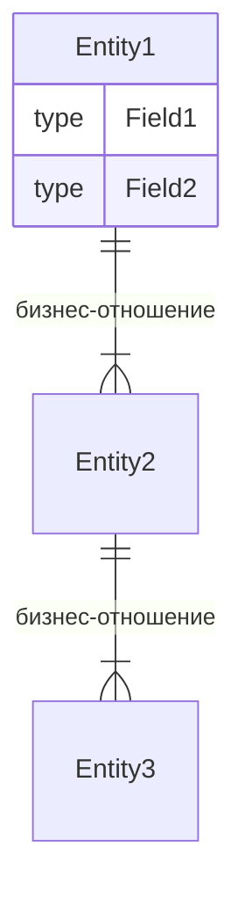

# Правила описания бизнес-документации

Правила создания и оформления файлов бизнес-документации в директории `docs/business/`.

## Общие принципы

### 1. Бизнес-ориентированность

Описывайте сущности с **бизнес-точки зрения**, а не технической:

- ❌ **Неправильно:** «Структура данных для хранения информации о проекте»
- ✅ **Правильно:** «Проект представляет собой конфигурацию автоматизированного пайплайна для конкретного репозитория»

### 2. Язык описания

- Пишите на **русском языке**
- Используйте **понятные бизнес-термины**
- Технические термины (ID, bool, string) оставляйте как есть
- Избегайте жаргона и излишней технической детализации

### 3. Структура файлов

Соблюдайте единую структуру файлов для согласованности документации.

## Описание бизнес-сущностей (`entity.md`)

### Структура описания каждой сущности

```markdown
## [Бизнес-название] ([CodeName])

**Название в коде:** `CodeName`

[Бизнес-описание сущности — 2-4 предложения]

### Поля

| Поле        | Тип  | Назначение               |
| ----------- | ---- | ------------------------ |
| `FieldName` | type | [Бизнес-назначение поля] |
```

### Правила описания сущностей

1. **Заголовок второго уровня** — бизнес-название сущности
2. **Название в коде** — выделите жирным и оберните в бэктики
3. **Описание** — объясните назначение сущности в бизнес-контексте
4. **Таблица полей** — обязательно включайте:
   - Имя поля (в бэкитиках)
   - Тип данных
   - Бизнес-назначение (что означает, а не как хранится)

### Описание связей между сущностями

В конце файла добавьте секцию со связями:

````markdown
## Связи между сущностями



- Один **Entity1** имеет множество **Entity2** (бизнес-пояснение)
- Один **Entity2** имеет множество **Entity3** (бизнес-пояснение)
````

### Правила описания связей

1. Используйте **Mermaid ER-диаграммы**
2. Показывайте только **значимые бизнес-связи**
3. Добавляйте **текстовые пояснения** к каждому типу связи
4. Включайте **список полей** для каждой сущности в диаграмме

## Форматирование

### Разделители

- ❌ **Запрещено** использовать разделитель `---` между заголовками и секциями
- ✅ **Разрешено** использовать только пустые строки для разделения секций
- Это правило обязательно для улучшения читаемости документов

### Таблицы

- Используйте **Markdown-таблицы** с выравниванием по левому краю
- Заголовки столбцов делайте **краткими и понятными**
- Выравнивайте столбцы по ширине заголовка для читаемости

### Код и имена

- **Названия в коде** — выделяйте бэкитиками: `CodeName`
- **API-методы** — пишите капсом: `GET`, `POST`, `PUT`, `DELETE`
- **Пути** — заключайте в бэкитики: `/api/v1/projects`

### Mermaid-диаграммы

- Используйте **mermaid** для визуализации связей
- Для ER-диаграмм используйте синтаксис `erDiagram`
- Добавляйте **русские подписи** к связям

## Обновление документации

### Когда обновлять

Обновляйте бизнес-документацию при:

- Добавлении новых сущностей
- Изменении структуры существующих сущностей
- Изменении бизнес-логики

### Порядок обновления

1. Внесите изменения в код
2. **Немедленно** обновите соответствующую документацию
3. Проверите, что связи описаны корректно
4. Убедитесь, что Mermaid-диаграммы отображаются корректно

## Примеры

### Хорошее описание поля

| Поле     | Тип    | Назначение                                       |
| -------- | ------ | ------------------------------------------------ |
| `GitURL` | string | URL Git-репозитория для получения исходного кода |

✅ Понятно бизнес-назначение

### Плохое описание поля

| Поле     | Тип    | Назначение            |
| -------- | ------ | --------------------- |
| `GitURL` | string | Поле для хранения URL |

❌ Слишком технически, неясно зачем нужно
