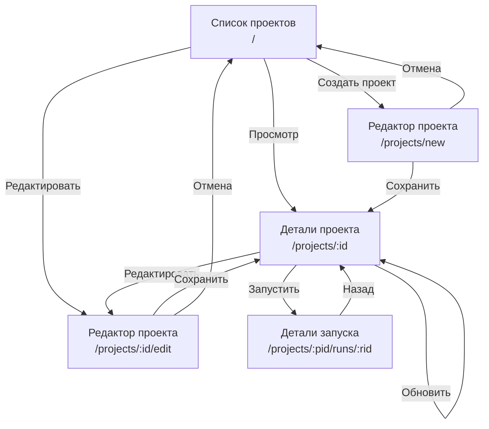

# Экраны приложения

Описание экранов приложения EasyJet, сущностей, действий и навигации между экранами.

## 1. Список проектов (Projects List)

**Путь:** `/`

**Компонент:** `pages/index.vue`

### Описание

Главный экран приложения. Отображает список всех проектов в системе.

### Сущности

| Сущность  | Использование                    |
| --------- | -------------------------------- |
| `Project` | Отображение списка: `id`, `name` |

### Действия

| Действие                 | Описание                               | Переход              |
| ------------------------ | -------------------------------------- | -------------------- |
| **Создать проект**       | Открытие формы создания нового проекта | `/projects/new`      |
| **Просмотр проекта**     | Переход к деталям проекта              | `/projects/:id`      |
| **Редактировать проект** | Открытие формы редактирования проекта  | `/projects/:id/edit` |

### API

- `GET /api/v1/projects` — получение списка всех проектов

## 2. Детали проекта (Project Detail)

**Путь:** `/projects/:id`

**Компонент:** `pages/Project.vue`

### Описание

Экран отображения подробной информации о проекте: настройки, этапы пайплайна и история запусков.

### Сущности

| Сущность     | Использование                                                                                                            |
| ------------ | ------------------------------------------------------------------------------------------------------------------------ |
| `Project`    | Полная информация: `id`, `name`, `created_at`, `dir`, `git_url`, `git_branch`, `cron_enabled`, `cron_schedule`, `stages` |
| `ProjectRun` | История запусков: `id`, `created_at`, `project_id`, `success`, `pending`, `processing`, `fail_log`                       |

### Действия

| Действие                     | Описание                              | Переход / Результат                  |
| ---------------------------- | ------------------------------------- | ------------------------------------ |
| **Редактировать проект**     | Открытие формы редактирования         | `/projects/:id/edit`                 |
| **Запустить проект**         | Создание нового запуска пайплайна     | `POST /api/v1/projects/:id/runs`     |
| **Просмотр запуска**         | Переход к деталям конкретного запуска | `/projects/:project_id/runs/:run_id` |
| **Обновить список запусков** | Перезагрузка истории запусков         | Обновление данных на экране          |

### Статусы запусков

| Статус       | Значение                   | Индикация         |
| ------------ | -------------------------- | ----------------- |
| `pending`    | Ожидание начала выполнения | Жёлтый (warning)  |
| `processing` | Выполняется                | Синий (info)      |
| `success`    | Успешно завершён           | Зелёный (success) |
| `fail`       | Завершён с ошибкой         | Красный (error)   |

### API

- `GET /api/v1/projects/:id` — получение информации о проекте
- `GET /api/v1/projects/:id/runs` — получение истории запусков
- `POST /api/v1/projects/:id/runs` — запуск проекта

## 3. Редактор проекта (Project Editor)

**Путь:**

- `/projects/new` — создание нового проекта
- `/projects/:id/edit` — редактирование существующего проекта

**Компонент:** `pages/ProjectEditor.vue`

### Описание

Экран для создания и редактирования проектов. Позволяет настроить параметры проекта и определить этапы пайплайна.

### Сущности

| Сущность       | Использование                                          |
| -------------- | ------------------------------------------------------ |
| `Project`      | `id`, `name`, `dir`, `git_url`, `git_branch`, `stages` |
| `ProjectStage` | Этапы пайплайна: `number`, `script`                    |

### Поля формы

| Поле           | Тип    | Обязательное | Описание                                             |
| -------------- | ------ | ------------ | ---------------------------------------------------- |
| `Name`         | string | Да           | Человеко-читаемое имя проекта                        |
| `Dir`          | string | Нет          | Локальный путь к рабочей директории                  |
| `GitURL`       | string | Нет          | URL Git-репозитория                                  |
| `GitBranch`    | string | Нет          | Имя ветки Git для сборки                             |
| `CronEnabled`  | bool   | Нет          | Флаг включения автоматического расписания            |
| `CronSchedule` | string | Нет          | Cron-выражение для автоматического запуска (5 полей) |
| `Stages`       | массив | Нет          | Список этапов пайплайна                              |

### Действия

| Действие             | Описание                             | Переход / Результат       |
| -------------------- | ------------------------------------ | ------------------------- |
| **Добавить этап**    | Добавление нового этапа пайплайна    | Добавление записи в форму |
| **Удалить этап**     | Удаление выбранного этапа            | Удаление записи из формы  |
| **Сохранить проект** | Создание или обновление проекта      | `/projects/:id` или `/`   |
| **Отмена**           | Отмена редактирования без сохранения | На предыдущий экран       |

### API

- `GET /api/v1/projects/:id` — загрузка данных для редактирования (только для редактирования)
- `POST /api/v1/projects` — создание нового проекта
- `PUT /api/v1/projects/:id` — обновление существующего проекта

## 4. Детали запуска (Project Run Detail)

**Путь:** `/projects/:project_id/runs/:run_id`

**Компонент:** `pages/ProjectRun.vue`

### Описание

Экран отображения результатов выполнения пайплайна: общий статус, логи по этапам и информация о Git-коммитах.

### Сущности

| Сущность               | Использование                                                                                                                          |
| ---------------------- | -------------------------------------------------------------------------------------------------------------------------------------- |
| `ProjectRun`           | Полная информация о запуске: `id`, `created_at`, `project_id`, `success`, `pending`, `processing`, `fail_log`, `stages`, `git_commits` |
| `Project`              | Информация о проекте: `id`, `name` (для отображения в заголовке)                                                                       |
| `ProjectRunStage`      | Результаты этапов: `stage_number`, `success`, `log`                                                                                    |
| `ProjectRunGitCommits` | Git-коммиты: `number`, `hash`, `subject`                                                                                               |

### Действия

| Действие            | Описание                  | Переход                 |
| ------------------- | ------------------------- | ----------------------- |
| **Назад к проекту** | Возврат к деталям проекта | `/projects/:project_id` |

### Отображаемая информация

- **Общий статус запуска** — визуальная индикация успеха/неудачи
- **Лог ошибки** — если запуск неудачный (`fail_log`)
- **Результаты этапов** — раскрывающиеся панели с логами каждого этапа
- **Git-коммиты** — список коммитов, связанных с запуском

### API

- `GET /api/v1/projects/:project_id/runs/:run_id` — получение информации о запуске
- `GET /api/v1/projects/:project_id` — получение информации о проекте

## Навигация между экранами

### Таблица переходов

| Откуда                               | Куда                         | Триггер                 | Метод           |
| ------------------------------------ | ---------------------------- | ----------------------- | --------------- |
| `/`                                  | `/projects/new`              | Кнопка «Создать проект» | `router.push()` |
| `/`                                  | `/projects/:id`              | Кнопка «Просмотр»       | `router.push()` |
| `/`                                  | `/projects/:id/edit`         | Кнопка «Редактировать»  | `router.push()` |
| `/projects/:id`                      | `/projects/:id/edit`         | Кнопка «Редактировать»  | `router.push()` |
| `/projects/:id`                      | `/projects/:id/runs/:run_id` | Клик по строке запуска  | `router.push()` |
| `/projects/:id/edit`                 | `/projects/:id`              | Сохранение или отмена   | `router.push()` |
| `/projects/new`                      | `/`                          | Отмена                  | `router.push()` |
| `/projects/:project_id/runs/:run_id` | `/projects/:project_id`      | Кнопка «Назад»          | `router.push()` |

## Сводная таблица экранов

| Экран            | Путь                                     | Сущности                                                           | Основные действия                              |
| ---------------- | ---------------------------------------- | ------------------------------------------------------------------ | ---------------------------------------------- |
| Список проектов  | `/`                                      | `Project` (список)                                                 | Создать, Просмотр, Редактировать               |
| Детали проекта   | `/projects/:id`                          | `Project`, `ProjectRun`                                            | Редактировать, Запустить, Просмотр запуска     |
| Редактор проекта | `/projects/new` `/projects/:id/edit` | `Project`, `ProjectStage`                                          | Добавить этап, Удалить этап, Сохранить, Отмена |
| Детали запуска   | `/projects/:project_id/runs/:run_id`     | `ProjectRun`, `ProjectRunStage`, `ProjectRunGitCommits`, `Project` | Назад к проекту                                |
