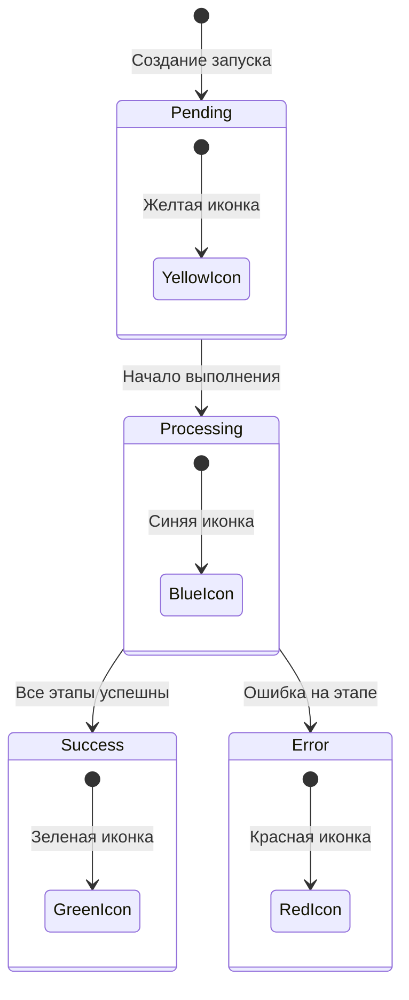

# Цветовая палитра иконок

Документация по использованию цветов для иконок и индикаторов статусов в интерфейсе EasyJet.

## Назначение цветов

| Статус                       | Цвет    | Код цвета | Hex       | Описание                                            |
| ---------------------------- | ------- | --------- | --------- | --------------------------------------------------- |
| **Успешно** (Success)        | Зеленый | `success` | `#4caf50` | Завершённые успешно операции, положительные статусы |
| **Ошибка** (Error)           | Красный | `error`   | `#ff5252` | Завершённые с ошибкой операции, негативные статусы  |
| **Выполняется** (Processing) | Синий   | `info`    | `#2196f3` | Активные процессы, выполняющиеся операции           |
| **В очереди** (Pending)      | Желтый  | `warning` | `#ff9800` | Ожидающие начала выполнения операции, очередь       |

## Использование в компонентах

### Vuetify цвета

В проекте используются стандартные цвета Vuetify, определённые в теме:

```ts
// frontend/src/plugins/vuetify.ts
colors: {
  error: '#ff5252',      // Красный - ошибка
  info: '#2196f3',       // Синий - выполняется
  success: '#4caf50',    // Зеленый - успешно
  warning: '#ff9800',    // Желтый - в очереди
}
```

### Примеры использования

#### В чипсах (v-chip)

```vue
<v-chip color="success" variant="tonal">Успешно</v-chip>
<v-chip color="error" variant="tonal">Ошибка</v-chip>
<v-chip color="info" variant="tonal">Выполняется</v-chip>
<v-chip color="warning" variant="tonal">В очереди</v-chip>
```

#### В иконках (v-icon)

```vue
<v-icon color="success" icon="mdi-check-circle" />
<v-icon color="error" icon="mdi-alert-circle" />
<v-icon color="info" icon="mdi-loading" />
<v-icon color="warning" icon="mdi-clock-outline" />
```

#### В функциях определения статуса

```ts
function getStatusColor(item: ProjectRun): string {
  if (item.pending) return "warning"; // Желтый - в очереди
  if (item.processing) return "info"; // Синий - выполняется
  return item.success ? "success" : "error"; // Зеленый/Красный - результат
}
```

## Бизнес-логика статусов

### ProjectRun (Запуск проекта)

| Статус      | Поле                | Цвет    | Значение                                        |
| ----------- | ------------------- | ------- | ----------------------------------------------- |
| В очереди   | `pending = true`    | Желтый  | Запуск создан, ожидает начала выполнения        |
| Выполняется | `processing = true` | Синий   | Пайплайн активно выполняется                    |
| Успешно     | `success = true`    | Зеленый | Все этапы завершены успешно                     |
| Ошибка      | `success = false`   | Красный | Один или несколько этапов завершились с ошибкой |

### ProjectRunStage (Этап запуска)

| Статус  | Поле              | Цвет    | Значение                  |
| ------- | ----------------- | ------- | ------------------------- |
| Успешно | `success = true`  | Зеленый | Этап выполнен успешно     |
| Ошибка  | `success = false` | Красный | Этап завершился с ошибкой |

## Иконки

Рекомендуемые иконки Material Design для каждого статуса:

| Статус      | Иконка | Код                                 |
| ----------- | ------ | ----------------------------------- |
| Успешно     | ✓      | `mdi-check-circle`                  |
| Ошибка      | ⚠      | `mdi-alert-circle`                  |
| Выполняется | ⏳     | `mdi-loading` или `mdi-cog-outline` |
| В очереди   | 🕐     | `mdi-clock-outline`                 |

## Диаграмма состояний



## Примечания

1. **Не изменять цвета** без согласования — они являются частью дизайн-системы
2. **Единообразие** — использовать одинаковые цвета для одинаковых статусов во всём приложении
3. **Доступность** — выбранные цвета имеют достаточный контраст для accessibility
4. **Тёмная и светлая тема** — цвета работают в обеих темах Vuetify
